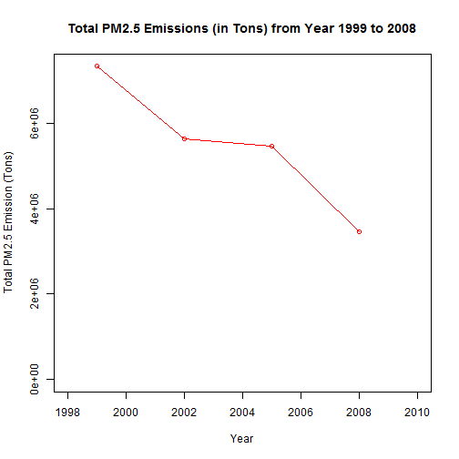
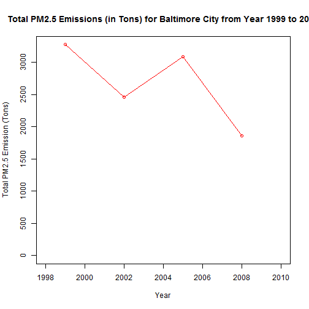
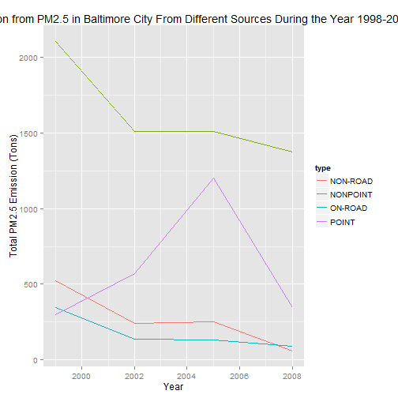

Peer Assessment 2 - Exploratory Data Analysis
========================================================
<p>
Code for peer assessment 2 - Exploratory Data Analysis
</p>


## Data Processing and Exploration

```r
# Read the rd file contents
setwd("F:/My Development/My Testing Ground/Data Science/Data Science Cert - Code/Exploratory Data Analysis/Week 3")
NEI = readRDS("summarySCC_PM25.rds")
SCC = readRDS("Source_Classification_Code.rds")
```


```r
# summary of NEI
str(NEI)
```

```
## 'data.frame':	6497651 obs. of  6 variables:
##  $ fips     : chr  "09001" "09001" "09001" "09001" ...
##  $ SCC      : chr  "10100401" "10100404" "10100501" "10200401" ...
##  $ Pollutant: chr  "PM25-PRI" "PM25-PRI" "PM25-PRI" "PM25-PRI" ...
##  $ Emissions: num  15.714 234.178 0.128 2.036 0.388 ...
##  $ type     : chr  "POINT" "POINT" "POINT" "POINT" ...
##  $ year     : int  1999 1999 1999 1999 1999 1999 1999 1999 1999 1999 ...
```

```r

# summary of SCC
str(SCC)
```

```
## 'data.frame':	11717 obs. of  15 variables:
##  $ SCC                : Factor w/ 11717 levels "10100101","10100102",..: 1 2 3 4 5 6 7 8 9 10 ...
##  $ Data.Category      : Factor w/ 6 levels "Biogenic","Event",..: 6 6 6 6 6 6 6 6 6 6 ...
##  $ Short.Name         : Factor w/ 11238 levels "","2,4-D Salts and Esters Prod /Process Vents, 2,4-D Recovery: Filtration",..: 3283 3284 3293 3291 3290 3294 3295 3296 3292 3289 ...
##  $ EI.Sector          : Factor w/ 59 levels "Agriculture - Crops & Livestock Dust",..: 18 18 18 18 18 18 18 18 18 18 ...
##  $ Option.Group       : Factor w/ 25 levels "","C/I Kerosene",..: 1 1 1 1 1 1 1 1 1 1 ...
##  $ Option.Set         : Factor w/ 18 levels "","A","B","B1A",..: 1 1 1 1 1 1 1 1 1 1 ...
##  $ SCC.Level.One      : Factor w/ 17 levels "Brick Kilns",..: 3 3 3 3 3 3 3 3 3 3 ...
##  $ SCC.Level.Two      : Factor w/ 146 levels "","Agricultural Chemicals Production",..: 32 32 32 32 32 32 32 32 32 32 ...
##  $ SCC.Level.Three    : Factor w/ 1061 levels "","100% Biosolids (e.g., sewage sludge, manure, mixtures of these matls)",..: 88 88 156 156 156 156 156 156 156 156 ...
##  $ SCC.Level.Four     : Factor w/ 6084 levels "","(NH4)2 SO4 Acid Bath System and Evaporator",..: 4455 5583 4466 4458 1341 5246 5584 5983 4461 776 ...
##  $ Map.To             : num  NA NA NA NA NA NA NA NA NA NA ...
##  $ Last.Inventory.Year: int  NA NA NA NA NA NA NA NA NA NA ...
##  $ Created_Date       : Factor w/ 57 levels "","1/27/2000 0:00:00",..: 1 1 1 1 1 1 1 1 1 1 ...
##  $ Revised_Date       : Factor w/ 44 levels "","1/27/2000 0:00:00",..: 1 1 1 1 1 1 1 1 1 1 ...
##  $ Usage.Notes        : Factor w/ 21 levels ""," ","includes bleaching towers, washer hoods, filtrate tanks, vacuum pump exhausts",..: 1 1 1 1 1 1 1 1 1 1 ...
```

```r

# top 10 entries in NEI
head(NEI, 10)
```

```
##     fips      SCC Pollutant Emissions  type year
## 4  09001 10100401  PM25-PRI    15.714 POINT 1999
## 8  09001 10100404  PM25-PRI   234.178 POINT 1999
## 12 09001 10100501  PM25-PRI     0.128 POINT 1999
## 16 09001 10200401  PM25-PRI     2.036 POINT 1999
## 20 09001 10200504  PM25-PRI     0.388 POINT 1999
## 24 09001 10200602  PM25-PRI     1.490 POINT 1999
## 28 09001 10200603  PM25-PRI     0.200 POINT 1999
## 32 09001 10300401  PM25-PRI     0.081 POINT 1999
## 36 09001 10300501  PM25-PRI     0.184 POINT 1999
## 40 09001 10300504  PM25-PRI     0.273 POINT 1999
```

```r

# top 10 entries in SCC
head(SCC, 10)
```

```
##         SCC Data.Category
## 1  10100101         Point
## 2  10100102         Point
## 3  10100201         Point
## 4  10100202         Point
## 5  10100203         Point
## 6  10100204         Point
## 7  10100205         Point
## 8  10100211         Point
## 9  10100212         Point
## 10 10100215         Point
##                                                                           Short.Name
## 1                           Ext Comb /Electric Gen /Anthracite Coal /Pulverized Coal
## 2         Ext Comb /Electric Gen /Anthracite Coal /Traveling Grate (Overfeed) Stoker
## 3               Ext Comb /Electric Gen /Bituminous Coal /Pulverized Coal: Wet Bottom
## 4               Ext Comb /Electric Gen /Bituminous Coal /Pulverized Coal: Dry Bottom
## 5                           Ext Comb /Electric Gen /Bituminous Coal /Cyclone Furnace
## 6                           Ext Comb /Electric Gen /Bituminous Coal /Spreader Stoker
## 7         Ext Comb /Electric Gen /Bituminous Coal /Traveling Grate (Overfeed) Stoker
## 8                   Ext Comb /Electric Gen /Bituminous Coal /Wet Bottom (Tangential)
## 9  Ext Comb /Electric Gen /Bituminous Coal /Pulverized Coal: Dry Bottom (Tangential)
## 10                              Ext Comb /Electric Gen /Bituminous Coal /Cell Burner
##                                 EI.Sector Option.Group Option.Set
## 1  Fuel Comb - Electric Generation - Coal                        
## 2  Fuel Comb - Electric Generation - Coal                        
## 3  Fuel Comb - Electric Generation - Coal                        
## 4  Fuel Comb - Electric Generation - Coal                        
## 5  Fuel Comb - Electric Generation - Coal                        
## 6  Fuel Comb - Electric Generation - Coal                        
## 7  Fuel Comb - Electric Generation - Coal                        
## 8  Fuel Comb - Electric Generation - Coal                        
## 9  Fuel Comb - Electric Generation - Coal                        
## 10 Fuel Comb - Electric Generation - Coal                        
##                  SCC.Level.One       SCC.Level.Two
## 1  External Combustion Boilers Electric Generation
## 2  External Combustion Boilers Electric Generation
## 3  External Combustion Boilers Electric Generation
## 4  External Combustion Boilers Electric Generation
## 5  External Combustion Boilers Electric Generation
## 6  External Combustion Boilers Electric Generation
## 7  External Combustion Boilers Electric Generation
## 8  External Combustion Boilers Electric Generation
## 9  External Combustion Boilers Electric Generation
## 10 External Combustion Boilers Electric Generation
##                  SCC.Level.Three
## 1                Anthracite Coal
## 2                Anthracite Coal
## 3  Bituminous/Subbituminous Coal
## 4  Bituminous/Subbituminous Coal
## 5  Bituminous/Subbituminous Coal
## 6  Bituminous/Subbituminous Coal
## 7  Bituminous/Subbituminous Coal
## 8  Bituminous/Subbituminous Coal
## 9  Bituminous/Subbituminous Coal
## 10 Bituminous/Subbituminous Coal
##                                                SCC.Level.Four Map.To
## 1                                             Pulverized Coal     NA
## 2                           Traveling Grate (Overfeed) Stoker     NA
## 3               Pulverized Coal: Wet Bottom (Bituminous Coal)     NA
## 4               Pulverized Coal: Dry Bottom (Bituminous Coal)     NA
## 5                           Cyclone Furnace (Bituminous Coal)     NA
## 6                           Spreader Stoker (Bituminous Coal)     NA
## 7         Traveling Grate (Overfeed) Stoker (Bituminous Coal)     NA
## 8                   Wet Bottom (Tangential) (Bituminous Coal)     NA
## 9  Pulverized Coal: Dry Bottom (Tangential) (Bituminous Coal)     NA
## 10                              Cell Burner (Bituminous Coal)     NA
##    Last.Inventory.Year Created_Date Revised_Date Usage.Notes
## 1                   NA                                      
## 2                   NA                                      
## 3                   NA                                      
## 4                   NA                                      
## 5                   NA                                      
## 6                   NA                                      
## 7                   NA                                      
## 8                   NA                                      
## 9                   NA                                      
## 10                  NA
```

```r

# description for 10100101
SCC[which(SCC$SCC == "10100101"), ]
```

```
##        SCC Data.Category
## 1 10100101         Point
##                                                 Short.Name
## 1 Ext Comb /Electric Gen /Anthracite Coal /Pulverized Coal
##                                EI.Sector Option.Group Option.Set
## 1 Fuel Comb - Electric Generation - Coal                        
##                 SCC.Level.One       SCC.Level.Two SCC.Level.Three
## 1 External Combustion Boilers Electric Generation Anthracite Coal
##    SCC.Level.Four Map.To Last.Inventory.Year Created_Date Revised_Date
## 1 Pulverized Coal     NA                  NA                          
##   Usage.Notes
## 1
```


### Question 1 : Have total emissions from PM2.5 decreased in the United States from 1999 to 2008? Using the base plotting system, make a plot showing the total PM2.5 emission from all sources for each of the years 1999, 2002, 2005, and 2008.?
<p>
Let's utilize a plot depicting the total emissions, over the years, across all sources to understand the fluctuation of emission from PM2.5.
</p>

```r
# Group emissions by year across all sources and find the total emission for
# each of the years
gdf = ddply(NEI, c("year"), function(x) c(TOTAL = sum(x$Emissions)))
```


```r
plot(gdf$year, gdf$TOTAL, type = "o", ylim = c(0, max(gdf$TOTAL)), xlim = c(1998, 
    2010), col = "red", xlab = "Year", ylab = "Total PM2.5 Emission (Tons)", 
    main = "Total PM2.5 Emissions (in Tons) from Year 1999 to 2008")
```

 


<p>
From the above graph it is clearly evident that emissions from PM2.5 has decreased from year 1998 to 2008
</p>


### Question 2 : Have total emissions from PM2.5 decreased in the Baltimore City, Maryland (fips == "24510") from 1999 to 2008? Use the base plotting system to make a plot answering this question.

```r

# Extract emission data for Baltimore City (fips == '24510')
gdf = NEI[which(NEI$fips == "24510"), ]

# For the city of Baltimore, group emissions by year across all sources and
# find the total emission for each of the years
gdf = ddply(gdf, c("year"), function(x) c(TOTAL = sum(x$Emissions)))

# Plot
plot(gdf$year, gdf$TOTAL, type = "o", ylim = c(0, max(gdf$TOTAL)), xlim = c(1998, 
    2010), col = "red", xlab = "Year", ylab = "Total PM2.5 Emission (Tons)", 
    main = "Total PM2.5 Emissions (in Tons) for Baltimore City from Year 1999 to 2008")
```

 


<p>
From the above graph it is clearly evident that in the City of Baltimore emission from PM2.5 decreased from year 1998 to 2008. However, the fall in the emission rate wasn't steady. As you can in the figure, the emission did decrease from 1998 to 2002, but bumped back up in 2005 before finally receding to lowest level in 2008.
</p>


### Question 3 : Of the four types of sources indicated by the type (point, nonpoint, onroad, nonroad) variable, which of these four sources have seen decreases in emissions from 1999–2008 for Baltimore City? Which have seen increases in emissions from 1999–2008? Use the ggplot2 plotting system to make a plot answer this question.

```r

# Extract emission data for Baltimore City (fips == '24510')
gdf = NEI[which(NEI$fips == "24510"), ]

# For the city of Baltimore, group emissions by year across all sources and
# find the total emission for each of the years
gdf = ddply(gdf, c("type", "year"), function(x) c(TOTAL = sum(x$Emissions)))

# Plot
ggplot(gdf, aes(x = year, y = TOTAL, colour = type)) + geom_line() + xlab("Year") + 
    ylab("Total PM2.5 Emission (Tons)") + ggtitle("Total Emission from PM2.5 in Baltimore City From Different Sources During the Year 1998-2008") + 
    labs(fill = "PM2.5 Emission Source Type")
```

 


<p>
Sources that have seen DECREASES in emission from 1999-2008 for Baltimore City:
NONPOINT
NON-ROAD
ON-ROAD

Sources that have seen INCREASES in emission from 1999-2008 for Baltimore City:
POINT
</p>
