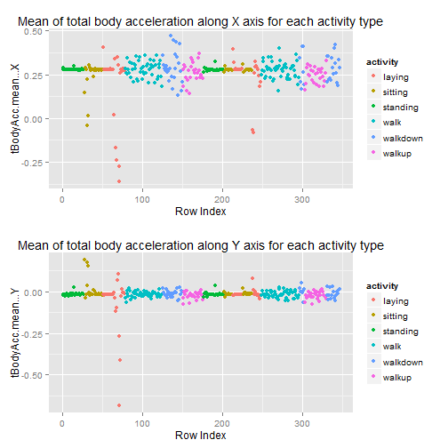
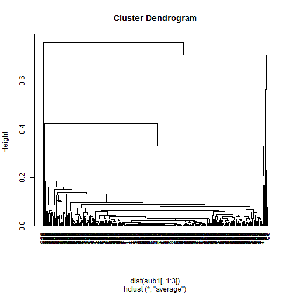
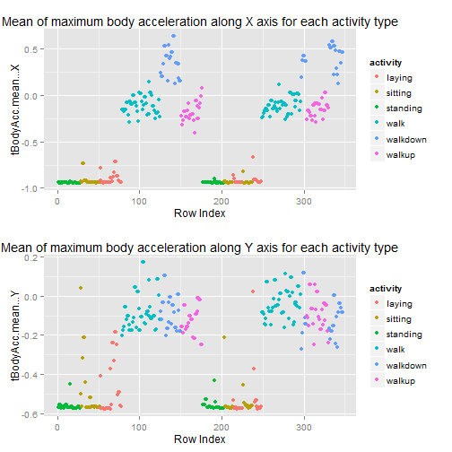
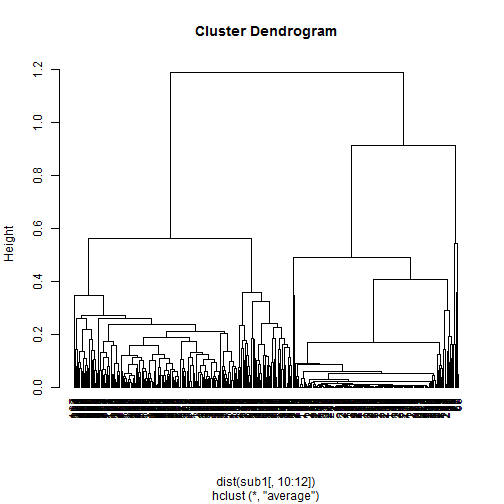
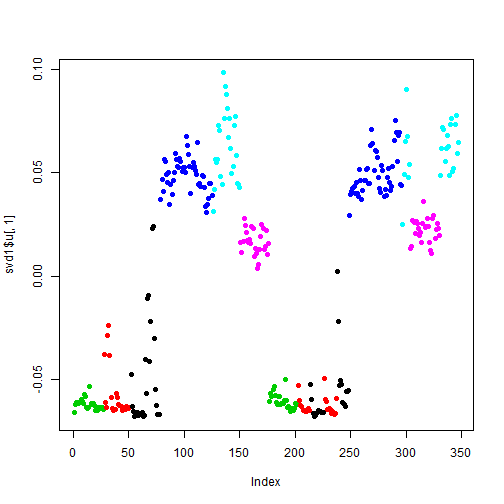
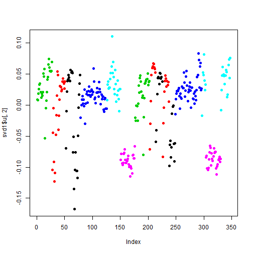

<!-- Make sure that the knitr package is installed and loaded. -->
<!-- For more info on the package options see http://yihui.name/knitr/options -->


<!-- Replace below with the title of your project -->
### Getting and Cleaning Data Course Project

<!-- Enter the code required to load your data in the space below. The data will be loaded but the line of code won't show up in your write up (echo=FALSE) in order to save space-->

<!-- In the remainder of the document, add R code chunks as needed -->

### Introduction:

This project reflects the implementation of some of the principles learned in this course. Some of these principles are:
<ol>
<li>Creating a tidy data from the original dataset</li>
<li>Creating and uploading the project to a Github repository</li>
<li>Documenting the steps as code book</li>
</ol>

### Data:

The orginal dataset can be downloaded from this location: https://d396qusza40orc.cloudfront.net/getdata%2Fprojectfiles%2FUCI%20HAR%20Dataset.zip. The read.me file contained in the zip file elaborates on the various variables included in the dataset. For brevity, I'm mentioning some of the variables below.
<ul>
<li>tBodyAcc-XYZ</li>
<li>tGravityAcc-XYZ</li>
<li>tBodyAccJerk-XYZ</li>
<li>tBodyGyro-XYZ</li>
<li>tBodyGyroJerk-XYZ</li>
<li>tBodyAccMag</li>
<li>tGravityAccMag</li>
<li>tBodyAccJerkMag</li>
<li>tBodyGyroMag</li>
<li>tBodyGyroJerkMag</li>
<li>fBodyAcc-XYZ</li>
<li>fBodyAccJerk-XYZ</li>
<li>fBodyGyro-XYZ</li>
<li>fBodyAccMag</li>
<li>fBodyAccJerkMag</li>
<li>fBodyGyroMag</li>
<li>fBodyGyroJerkMag</li>
</ul>

The set of variables that were estimated from these signals are: 
<ul>
<li>mean(): Mean value</li>
<li>std(): Standard deviation</li>
<li>mad(): Median absolute deviation</li> 
<li>max(): Largest value in array</li>
<li>min(): Smallest value in array</li>
<li>sma(): Signal magnitude area</li>
<li>energy(): Energy measure. Sum of the squares divided by the number of values. </li>
<li>iqr(): Interquartile range </li>
<li>entropy(): Signal entropy</li>
<li>arCoeff(): Autorregresion coefficients with Burg order equal to 4</li>
<li>correlation(): correlation coefficient between two signals</li>
<li>maxInds(): index of the frequency component with largest magnitude</li>
<li>meanFreq(): Weighted average of the frequency components to obtain a mean frequency</li>
<li>skewness(): skewness of the frequency domain signal </li>
<li>kurtosis(): kurtosis of the frequency domain signal </li>
<li>bandsEnergy(): Energy of a frequency interval within the 64 bins of the FFT of each window.</li>
<li>angle(): Angle between to vectors.</li>
</ul>
Additional vectors obtained by averaging the signals in a signal window sample. These are used on the angle() variable:

<ul>
<li>gravityMean</li>
<li>tBodyAccMean</li>
<li>tBodyAccJerkMean</li>
<li>tBodyGyroMean</li>
<li>tBodyGyroJerkMean</li>
</ul>


### Steps Performed in the R Script (run_analysis.R):

Following is the list of steps performed.
<h4> Preliminary Step </h4>
Load the training and test datasets into two variables trainData and testData, respectively. Once loaded, we move onto the next step.

```r
#### TRAINING DATA FRAME ######################################## Load the
#### training data into a dataframe. ###################### ~ Load the feature
#### data
trainX = read.table("./UCI_HAR_Dataset/train/X_train.txt", header = FALSE, sep = "")
# ~ Load the subject data
trainSub = read.table("./UCI_HAR_Dataset/train/subject_train.txt", header = FALSE, 
    sep = "")
# ~ Load the activity data
trainActivity = read.table("./UCI_HAR_Dataset/train/y_train.txt", header = FALSE, 
    sep = "")
# ~ Finally construct the full training dataset
trainData = cbind(trainX, trainSub, trainActivity)
getwd()

#### TEST DATA FRAME ############################################ Load the
#### test/validation data into a dataframe. ############### ~ Load the feature
#### data
testY = read.table("./UCI_HAR_Dataset/test/X_test.txt", header = FALSE, sep = "")
# ~ Load the subject data
testSub = read.table("./UCI_HAR_Dataset/test/subject_test.txt", header = FALSE, 
    sep = "")
# ~ Load the activity data
testActivity = read.table("./UCI_HAR_Dataset/test/y_test.txt", header = FALSE, 
    sep = "")
# ~ Finally construct the full test dataset
testData = cbind(testY, testSub, testActivity)

```


<h4>Step 1: Merges the training and the test sets to create one data set.</h4>
Merge training and test data table into one dataframe and provide the column names

```r
#### STEP 1 : MERGE DATA FRAMES ################################# Merge
#### training and test data table into one dataframe and provide the column
#### names
mergedData = rbind(trainData, testData)
variableNames = read.table("./UCI_HAR_Dataset/features.txt", header = FALSE, 
    sep = "")
names(mergedData) = variableNames$V2  # Feature column 
names(mergedData)[562] = "Subject"  # Subject column 
names(mergedData)[563] = "Activity"  # Activity column
```


<h4>Step 2: Extracts only the measurements on the mean and standard deviation for each measurement. </h4>
From the merged dataset (mergedData), find those indices whose variables represent a 'Mean' or 'Std'. In other words,
find those variables/columns that either have a 'mean' or 'std' in their names. Using the indices, find subset from 
'mergedData' where the column number/index matches those indices.

```r
### STEP 2: EXTRACT REQUIRED VARIABLES/COLUMNS ############### From the merged
### dataset (mergedData), find those indices whose variables represent a
### 'Mean' or 'Std'. In other words, find those variables/columns that either
### have a 'mean' or 'std' in their names. Using the indices, find subset from
### 'mergedData' where the column number/index matches those indices.
indices = c(grep("std+", variableNames$V2, value = FALSE), grep("mean+", variableNames$V2, 
    value = FALSE))
dataWithStdMean = mergedData[, indices]
```


<h4>Step 3: Uses descriptive activity names to name the activities in the data set. </h4>
For the 'mergedData' dataset (created above), change the values in the activity as follows:
<ul>
 <li>change 1 to 'WALKING'</li>
 <li>change 2 to 'WALKING_UPSTAIRS'</li>
 <li>change 3 to 'WALKING_DOWNSTAIRS'</li>
 <li>change 4 to 'SITTING'</li>
 <li>change 5 to 'STANDING'</li>
 <li>change 6 to 'LAYING'</li>
</ul>

```r
mergedData$Activity = sub("1+", "WALKING", mergedData$Activity)
mergedData$Activity = sub("2+", "WALKING_UPSTAIRS", mergedData$Activity)
mergedData$Activity = sub("3+", "WALKING_DOWNSTAIRS", mergedData$Activity)
mergedData$Activity = sub("4+", "SITTING", mergedData$Activity)
mergedData$Activity = sub("5+", "STANDING", mergedData$Activity)
mergedData$Activity = sub("6+", "LAYING", mergedData$Activity)
```


<h4>Step 4: Appropriately labels the data set with descriptive activity names. </h4>
For the 'mergedData' dataset (created in Step 3), change the existing column names with more user friendly names.

```r
# ~ Remove all ()
names(mergedData) = gsub(pattern = "\\(\\)", "", names(mergedData))
# ~ Rename all 'mad' to 'medianDeviation'
names(mergedData) = gsub(pattern = "mad", "medianDeviation", names(mergedData))
# ~ Rename all 'sma' to 'signalMagtdAread'
names(mergedData) = gsub(pattern = "sma", "signalMagtdArea", names(mergedData))
names(mergedData)
```


<h4>Step 5: Creates a second, independent tidy data set with the average of each variable for each activity and each subject. </h4>
From the 'mergedData' dataset (created in Step 4), create another dataset - 'featureAverageData' that contains the average of each feature/column for each combination of activty and subject. That is, find the mean of all features from column 1 through 561 in the 'mergedData' dataset. We are excluding column 562 and 563 b/c it contains the grouping factors 'Subject' and 'Activity', respectively.


```r
featureAverageData = aggregate(mergedData[, 1:561], by = list(Activity = mergedData$Activity, 
    Subject = mergedData$Subject), FUN = mean, na.rm = TRUE)
featureAverageData
```


### Cluster Analysis:

```r
load("./clusteringEx_data/data/samsungData.rda")

# all names
names(samsungData)
```

```
##   [1] "tBodyAcc-mean()-X"                   
##   [2] "tBodyAcc-mean()-Y"                   
##   [3] "tBodyAcc-mean()-Z"                   
##   [4] "tBodyAcc-std()-X"                    
##   [5] "tBodyAcc-std()-Y"                    
##   [6] "tBodyAcc-std()-Z"                    
##   [7] "tBodyAcc-mad()-X"                    
##   [8] "tBodyAcc-mad()-Y"                    
##   [9] "tBodyAcc-mad()-Z"                    
##  [10] "tBodyAcc-max()-X"                    
##  [11] "tBodyAcc-max()-Y"                    
##  [12] "tBodyAcc-max()-Z"                    
##  [13] "tBodyAcc-min()-X"                    
##  [14] "tBodyAcc-min()-Y"                    
##  [15] "tBodyAcc-min()-Z"                    
##  [16] "tBodyAcc-sma()"                      
##  [17] "tBodyAcc-energy()-X"                 
##  [18] "tBodyAcc-energy()-Y"                 
##  [19] "tBodyAcc-energy()-Z"                 
##  [20] "tBodyAcc-iqr()-X"                    
##  [21] "tBodyAcc-iqr()-Y"                    
##  [22] "tBodyAcc-iqr()-Z"                    
##  [23] "tBodyAcc-entropy()-X"                
##  [24] "tBodyAcc-entropy()-Y"                
##  [25] "tBodyAcc-entropy()-Z"                
##  [26] "tBodyAcc-arCoeff()-X,1"              
##  [27] "tBodyAcc-arCoeff()-X,2"              
##  [28] "tBodyAcc-arCoeff()-X,3"              
##  [29] "tBodyAcc-arCoeff()-X,4"              
##  [30] "tBodyAcc-arCoeff()-Y,1"              
##  [31] "tBodyAcc-arCoeff()-Y,2"              
##  [32] "tBodyAcc-arCoeff()-Y,3"              
##  [33] "tBodyAcc-arCoeff()-Y,4"              
##  [34] "tBodyAcc-arCoeff()-Z,1"              
##  [35] "tBodyAcc-arCoeff()-Z,2"              
##  [36] "tBodyAcc-arCoeff()-Z,3"              
##  [37] "tBodyAcc-arCoeff()-Z,4"              
##  [38] "tBodyAcc-correlation()-X,Y"          
##  [39] "tBodyAcc-correlation()-X,Z"          
##  [40] "tBodyAcc-correlation()-Y,Z"          
##  [41] "tGravityAcc-mean()-X"                
##  [42] "tGravityAcc-mean()-Y"                
##  [43] "tGravityAcc-mean()-Z"                
##  [44] "tGravityAcc-std()-X"                 
##  [45] "tGravityAcc-std()-Y"                 
##  [46] "tGravityAcc-std()-Z"                 
##  [47] "tGravityAcc-mad()-X"                 
##  [48] "tGravityAcc-mad()-Y"                 
##  [49] "tGravityAcc-mad()-Z"                 
##  [50] "tGravityAcc-max()-X"                 
##  [51] "tGravityAcc-max()-Y"                 
##  [52] "tGravityAcc-max()-Z"                 
##  [53] "tGravityAcc-min()-X"                 
##  [54] "tGravityAcc-min()-Y"                 
##  [55] "tGravityAcc-min()-Z"                 
##  [56] "tGravityAcc-sma()"                   
##  [57] "tGravityAcc-energy()-X"              
##  [58] "tGravityAcc-energy()-Y"              
##  [59] "tGravityAcc-energy()-Z"              
##  [60] "tGravityAcc-iqr()-X"                 
##  [61] "tGravityAcc-iqr()-Y"                 
##  [62] "tGravityAcc-iqr()-Z"                 
##  [63] "tGravityAcc-entropy()-X"             
##  [64] "tGravityAcc-entropy()-Y"             
##  [65] "tGravityAcc-entropy()-Z"             
##  [66] "tGravityAcc-arCoeff()-X,1"           
##  [67] "tGravityAcc-arCoeff()-X,2"           
##  [68] "tGravityAcc-arCoeff()-X,3"           
##  [69] "tGravityAcc-arCoeff()-X,4"           
##  [70] "tGravityAcc-arCoeff()-Y,1"           
##  [71] "tGravityAcc-arCoeff()-Y,2"           
##  [72] "tGravityAcc-arCoeff()-Y,3"           
##  [73] "tGravityAcc-arCoeff()-Y,4"           
##  [74] "tGravityAcc-arCoeff()-Z,1"           
##  [75] "tGravityAcc-arCoeff()-Z,2"           
##  [76] "tGravityAcc-arCoeff()-Z,3"           
##  [77] "tGravityAcc-arCoeff()-Z,4"           
##  [78] "tGravityAcc-correlation()-X,Y"       
##  [79] "tGravityAcc-correlation()-X,Z"       
##  [80] "tGravityAcc-correlation()-Y,Z"       
##  [81] "tBodyAccJerk-mean()-X"               
##  [82] "tBodyAccJerk-mean()-Y"               
##  [83] "tBodyAccJerk-mean()-Z"               
##  [84] "tBodyAccJerk-std()-X"                
##  [85] "tBodyAccJerk-std()-Y"                
##  [86] "tBodyAccJerk-std()-Z"                
##  [87] "tBodyAccJerk-mad()-X"                
##  [88] "tBodyAccJerk-mad()-Y"                
##  [89] "tBodyAccJerk-mad()-Z"                
##  [90] "tBodyAccJerk-max()-X"                
##  [91] "tBodyAccJerk-max()-Y"                
##  [92] "tBodyAccJerk-max()-Z"                
##  [93] "tBodyAccJerk-min()-X"                
##  [94] "tBodyAccJerk-min()-Y"                
##  [95] "tBodyAccJerk-min()-Z"                
##  [96] "tBodyAccJerk-sma()"                  
##  [97] "tBodyAccJerk-energy()-X"             
##  [98] "tBodyAccJerk-energy()-Y"             
##  [99] "tBodyAccJerk-energy()-Z"             
## [100] "tBodyAccJerk-iqr()-X"                
## [101] "tBodyAccJerk-iqr()-Y"                
## [102] "tBodyAccJerk-iqr()-Z"                
## [103] "tBodyAccJerk-entropy()-X"            
## [104] "tBodyAccJerk-entropy()-Y"            
## [105] "tBodyAccJerk-entropy()-Z"            
## [106] "tBodyAccJerk-arCoeff()-X,1"          
## [107] "tBodyAccJerk-arCoeff()-X,2"          
## [108] "tBodyAccJerk-arCoeff()-X,3"          
## [109] "tBodyAccJerk-arCoeff()-X,4"          
## [110] "tBodyAccJerk-arCoeff()-Y,1"          
## [111] "tBodyAccJerk-arCoeff()-Y,2"          
## [112] "tBodyAccJerk-arCoeff()-Y,3"          
## [113] "tBodyAccJerk-arCoeff()-Y,4"          
## [114] "tBodyAccJerk-arCoeff()-Z,1"          
## [115] "tBodyAccJerk-arCoeff()-Z,2"          
## [116] "tBodyAccJerk-arCoeff()-Z,3"          
## [117] "tBodyAccJerk-arCoeff()-Z,4"          
## [118] "tBodyAccJerk-correlation()-X,Y"      
## [119] "tBodyAccJerk-correlation()-X,Z"      
## [120] "tBodyAccJerk-correlation()-Y,Z"      
## [121] "tBodyGyro-mean()-X"                  
## [122] "tBodyGyro-mean()-Y"                  
## [123] "tBodyGyro-mean()-Z"                  
## [124] "tBodyGyro-std()-X"                   
## [125] "tBodyGyro-std()-Y"                   
## [126] "tBodyGyro-std()-Z"                   
## [127] "tBodyGyro-mad()-X"                   
## [128] "tBodyGyro-mad()-Y"                   
## [129] "tBodyGyro-mad()-Z"                   
## [130] "tBodyGyro-max()-X"                   
## [131] "tBodyGyro-max()-Y"                   
## [132] "tBodyGyro-max()-Z"                   
## [133] "tBodyGyro-min()-X"                   
## [134] "tBodyGyro-min()-Y"                   
## [135] "tBodyGyro-min()-Z"                   
## [136] "tBodyGyro-sma()"                     
## [137] "tBodyGyro-energy()-X"                
## [138] "tBodyGyro-energy()-Y"                
## [139] "tBodyGyro-energy()-Z"                
## [140] "tBodyGyro-iqr()-X"                   
## [141] "tBodyGyro-iqr()-Y"                   
## [142] "tBodyGyro-iqr()-Z"                   
## [143] "tBodyGyro-entropy()-X"               
## [144] "tBodyGyro-entropy()-Y"               
## [145] "tBodyGyro-entropy()-Z"               
## [146] "tBodyGyro-arCoeff()-X,1"             
## [147] "tBodyGyro-arCoeff()-X,2"             
## [148] "tBodyGyro-arCoeff()-X,3"             
## [149] "tBodyGyro-arCoeff()-X,4"             
## [150] "tBodyGyro-arCoeff()-Y,1"             
## [151] "tBodyGyro-arCoeff()-Y,2"             
## [152] "tBodyGyro-arCoeff()-Y,3"             
## [153] "tBodyGyro-arCoeff()-Y,4"             
## [154] "tBodyGyro-arCoeff()-Z,1"             
## [155] "tBodyGyro-arCoeff()-Z,2"             
## [156] "tBodyGyro-arCoeff()-Z,3"             
## [157] "tBodyGyro-arCoeff()-Z,4"             
## [158] "tBodyGyro-correlation()-X,Y"         
## [159] "tBodyGyro-correlation()-X,Z"         
## [160] "tBodyGyro-correlation()-Y,Z"         
## [161] "tBodyGyroJerk-mean()-X"              
## [162] "tBodyGyroJerk-mean()-Y"              
## [163] "tBodyGyroJerk-mean()-Z"              
## [164] "tBodyGyroJerk-std()-X"               
## [165] "tBodyGyroJerk-std()-Y"               
## [166] "tBodyGyroJerk-std()-Z"               
## [167] "tBodyGyroJerk-mad()-X"               
## [168] "tBodyGyroJerk-mad()-Y"               
## [169] "tBodyGyroJerk-mad()-Z"               
## [170] "tBodyGyroJerk-max()-X"               
## [171] "tBodyGyroJerk-max()-Y"               
## [172] "tBodyGyroJerk-max()-Z"               
## [173] "tBodyGyroJerk-min()-X"               
## [174] "tBodyGyroJerk-min()-Y"               
## [175] "tBodyGyroJerk-min()-Z"               
## [176] "tBodyGyroJerk-sma()"                 
## [177] "tBodyGyroJerk-energy()-X"            
## [178] "tBodyGyroJerk-energy()-Y"            
## [179] "tBodyGyroJerk-energy()-Z"            
## [180] "tBodyGyroJerk-iqr()-X"               
## [181] "tBodyGyroJerk-iqr()-Y"               
## [182] "tBodyGyroJerk-iqr()-Z"               
## [183] "tBodyGyroJerk-entropy()-X"           
## [184] "tBodyGyroJerk-entropy()-Y"           
## [185] "tBodyGyroJerk-entropy()-Z"           
## [186] "tBodyGyroJerk-arCoeff()-X,1"         
## [187] "tBodyGyroJerk-arCoeff()-X,2"         
## [188] "tBodyGyroJerk-arCoeff()-X,3"         
## [189] "tBodyGyroJerk-arCoeff()-X,4"         
## [190] "tBodyGyroJerk-arCoeff()-Y,1"         
## [191] "tBodyGyroJerk-arCoeff()-Y,2"         
## [192] "tBodyGyroJerk-arCoeff()-Y,3"         
## [193] "tBodyGyroJerk-arCoeff()-Y,4"         
## [194] "tBodyGyroJerk-arCoeff()-Z,1"         
## [195] "tBodyGyroJerk-arCoeff()-Z,2"         
## [196] "tBodyGyroJerk-arCoeff()-Z,3"         
## [197] "tBodyGyroJerk-arCoeff()-Z,4"         
## [198] "tBodyGyroJerk-correlation()-X,Y"     
## [199] "tBodyGyroJerk-correlation()-X,Z"     
## [200] "tBodyGyroJerk-correlation()-Y,Z"     
## [201] "tBodyAccMag-mean()"                  
## [202] "tBodyAccMag-std()"                   
## [203] "tBodyAccMag-mad()"                   
## [204] "tBodyAccMag-max()"                   
## [205] "tBodyAccMag-min()"                   
## [206] "tBodyAccMag-sma()"                   
## [207] "tBodyAccMag-energy()"                
## [208] "tBodyAccMag-iqr()"                   
## [209] "tBodyAccMag-entropy()"               
## [210] "tBodyAccMag-arCoeff()1"              
## [211] "tBodyAccMag-arCoeff()2"              
## [212] "tBodyAccMag-arCoeff()3"              
## [213] "tBodyAccMag-arCoeff()4"              
## [214] "tGravityAccMag-mean()"               
## [215] "tGravityAccMag-std()"                
## [216] "tGravityAccMag-mad()"                
## [217] "tGravityAccMag-max()"                
## [218] "tGravityAccMag-min()"                
## [219] "tGravityAccMag-sma()"                
## [220] "tGravityAccMag-energy()"             
## [221] "tGravityAccMag-iqr()"                
## [222] "tGravityAccMag-entropy()"            
## [223] "tGravityAccMag-arCoeff()1"           
## [224] "tGravityAccMag-arCoeff()2"           
## [225] "tGravityAccMag-arCoeff()3"           
## [226] "tGravityAccMag-arCoeff()4"           
## [227] "tBodyAccJerkMag-mean()"              
## [228] "tBodyAccJerkMag-std()"               
## [229] "tBodyAccJerkMag-mad()"               
## [230] "tBodyAccJerkMag-max()"               
## [231] "tBodyAccJerkMag-min()"               
## [232] "tBodyAccJerkMag-sma()"               
## [233] "tBodyAccJerkMag-energy()"            
## [234] "tBodyAccJerkMag-iqr()"               
## [235] "tBodyAccJerkMag-entropy()"           
## [236] "tBodyAccJerkMag-arCoeff()1"          
## [237] "tBodyAccJerkMag-arCoeff()2"          
## [238] "tBodyAccJerkMag-arCoeff()3"          
## [239] "tBodyAccJerkMag-arCoeff()4"          
## [240] "tBodyGyroMag-mean()"                 
## [241] "tBodyGyroMag-std()"                  
## [242] "tBodyGyroMag-mad()"                  
## [243] "tBodyGyroMag-max()"                  
## [244] "tBodyGyroMag-min()"                  
## [245] "tBodyGyroMag-sma()"                  
## [246] "tBodyGyroMag-energy()"               
## [247] "tBodyGyroMag-iqr()"                  
## [248] "tBodyGyroMag-entropy()"              
## [249] "tBodyGyroMag-arCoeff()1"             
## [250] "tBodyGyroMag-arCoeff()2"             
## [251] "tBodyGyroMag-arCoeff()3"             
## [252] "tBodyGyroMag-arCoeff()4"             
## [253] "tBodyGyroJerkMag-mean()"             
## [254] "tBodyGyroJerkMag-std()"              
## [255] "tBodyGyroJerkMag-mad()"              
## [256] "tBodyGyroJerkMag-max()"              
## [257] "tBodyGyroJerkMag-min()"              
## [258] "tBodyGyroJerkMag-sma()"              
## [259] "tBodyGyroJerkMag-energy()"           
## [260] "tBodyGyroJerkMag-iqr()"              
## [261] "tBodyGyroJerkMag-entropy()"          
## [262] "tBodyGyroJerkMag-arCoeff()1"         
## [263] "tBodyGyroJerkMag-arCoeff()2"         
## [264] "tBodyGyroJerkMag-arCoeff()3"         
## [265] "tBodyGyroJerkMag-arCoeff()4"         
## [266] "fBodyAcc-mean()-X"                   
## [267] "fBodyAcc-mean()-Y"                   
## [268] "fBodyAcc-mean()-Z"                   
## [269] "fBodyAcc-std()-X"                    
## [270] "fBodyAcc-std()-Y"                    
## [271] "fBodyAcc-std()-Z"                    
## [272] "fBodyAcc-mad()-X"                    
## [273] "fBodyAcc-mad()-Y"                    
## [274] "fBodyAcc-mad()-Z"                    
## [275] "fBodyAcc-max()-X"                    
## [276] "fBodyAcc-max()-Y"                    
## [277] "fBodyAcc-max()-Z"                    
## [278] "fBodyAcc-min()-X"                    
## [279] "fBodyAcc-min()-Y"                    
## [280] "fBodyAcc-min()-Z"                    
## [281] "fBodyAcc-sma()"                      
## [282] "fBodyAcc-energy()-X"                 
## [283] "fBodyAcc-energy()-Y"                 
## [284] "fBodyAcc-energy()-Z"                 
## [285] "fBodyAcc-iqr()-X"                    
## [286] "fBodyAcc-iqr()-Y"                    
## [287] "fBodyAcc-iqr()-Z"                    
## [288] "fBodyAcc-entropy()-X"                
## [289] "fBodyAcc-entropy()-Y"                
## [290] "fBodyAcc-entropy()-Z"                
## [291] "fBodyAcc-maxInds-X"                  
## [292] "fBodyAcc-maxInds-Y"                  
## [293] "fBodyAcc-maxInds-Z"                  
## [294] "fBodyAcc-meanFreq()-X"               
## [295] "fBodyAcc-meanFreq()-Y"               
## [296] "fBodyAcc-meanFreq()-Z"               
## [297] "fBodyAcc-skewness()-X"               
## [298] "fBodyAcc-kurtosis()-X"               
## [299] "fBodyAcc-skewness()-Y"               
## [300] "fBodyAcc-kurtosis()-Y"               
## [301] "fBodyAcc-skewness()-Z"               
## [302] "fBodyAcc-kurtosis()-Z"               
## [303] "fBodyAcc-bandsEnergy()-1,8"          
## [304] "fBodyAcc-bandsEnergy()-9,16"         
## [305] "fBodyAcc-bandsEnergy()-17,24"        
## [306] "fBodyAcc-bandsEnergy()-25,32"        
## [307] "fBodyAcc-bandsEnergy()-33,40"        
## [308] "fBodyAcc-bandsEnergy()-41,48"        
## [309] "fBodyAcc-bandsEnergy()-49,56"        
## [310] "fBodyAcc-bandsEnergy()-57,64"        
## [311] "fBodyAcc-bandsEnergy()-1,16"         
## [312] "fBodyAcc-bandsEnergy()-17,32"        
## [313] "fBodyAcc-bandsEnergy()-33,48"        
## [314] "fBodyAcc-bandsEnergy()-49,64"        
## [315] "fBodyAcc-bandsEnergy()-1,24"         
## [316] "fBodyAcc-bandsEnergy()-25,48"        
## [317] "fBodyAcc-bandsEnergy()-1,8"          
## [318] "fBodyAcc-bandsEnergy()-9,16"         
## [319] "fBodyAcc-bandsEnergy()-17,24"        
## [320] "fBodyAcc-bandsEnergy()-25,32"        
## [321] "fBodyAcc-bandsEnergy()-33,40"        
## [322] "fBodyAcc-bandsEnergy()-41,48"        
## [323] "fBodyAcc-bandsEnergy()-49,56"        
## [324] "fBodyAcc-bandsEnergy()-57,64"        
## [325] "fBodyAcc-bandsEnergy()-1,16"         
## [326] "fBodyAcc-bandsEnergy()-17,32"        
## [327] "fBodyAcc-bandsEnergy()-33,48"        
## [328] "fBodyAcc-bandsEnergy()-49,64"        
## [329] "fBodyAcc-bandsEnergy()-1,24"         
## [330] "fBodyAcc-bandsEnergy()-25,48"        
## [331] "fBodyAcc-bandsEnergy()-1,8"          
## [332] "fBodyAcc-bandsEnergy()-9,16"         
## [333] "fBodyAcc-bandsEnergy()-17,24"        
## [334] "fBodyAcc-bandsEnergy()-25,32"        
## [335] "fBodyAcc-bandsEnergy()-33,40"        
## [336] "fBodyAcc-bandsEnergy()-41,48"        
## [337] "fBodyAcc-bandsEnergy()-49,56"        
## [338] "fBodyAcc-bandsEnergy()-57,64"        
## [339] "fBodyAcc-bandsEnergy()-1,16"         
## [340] "fBodyAcc-bandsEnergy()-17,32"        
## [341] "fBodyAcc-bandsEnergy()-33,48"        
## [342] "fBodyAcc-bandsEnergy()-49,64"        
## [343] "fBodyAcc-bandsEnergy()-1,24"         
## [344] "fBodyAcc-bandsEnergy()-25,48"        
## [345] "fBodyAccJerk-mean()-X"               
## [346] "fBodyAccJerk-mean()-Y"               
## [347] "fBodyAccJerk-mean()-Z"               
## [348] "fBodyAccJerk-std()-X"                
## [349] "fBodyAccJerk-std()-Y"                
## [350] "fBodyAccJerk-std()-Z"                
## [351] "fBodyAccJerk-mad()-X"                
## [352] "fBodyAccJerk-mad()-Y"                
## [353] "fBodyAccJerk-mad()-Z"                
## [354] "fBodyAccJerk-max()-X"                
## [355] "fBodyAccJerk-max()-Y"                
## [356] "fBodyAccJerk-max()-Z"                
## [357] "fBodyAccJerk-min()-X"                
## [358] "fBodyAccJerk-min()-Y"                
## [359] "fBodyAccJerk-min()-Z"                
## [360] "fBodyAccJerk-sma()"                  
## [361] "fBodyAccJerk-energy()-X"             
## [362] "fBodyAccJerk-energy()-Y"             
## [363] "fBodyAccJerk-energy()-Z"             
## [364] "fBodyAccJerk-iqr()-X"                
## [365] "fBodyAccJerk-iqr()-Y"                
## [366] "fBodyAccJerk-iqr()-Z"                
## [367] "fBodyAccJerk-entropy()-X"            
## [368] "fBodyAccJerk-entropy()-Y"            
## [369] "fBodyAccJerk-entropy()-Z"            
## [370] "fBodyAccJerk-maxInds-X"              
## [371] "fBodyAccJerk-maxInds-Y"              
## [372] "fBodyAccJerk-maxInds-Z"              
## [373] "fBodyAccJerk-meanFreq()-X"           
## [374] "fBodyAccJerk-meanFreq()-Y"           
## [375] "fBodyAccJerk-meanFreq()-Z"           
## [376] "fBodyAccJerk-skewness()-X"           
## [377] "fBodyAccJerk-kurtosis()-X"           
## [378] "fBodyAccJerk-skewness()-Y"           
## [379] "fBodyAccJerk-kurtosis()-Y"           
## [380] "fBodyAccJerk-skewness()-Z"           
## [381] "fBodyAccJerk-kurtosis()-Z"           
## [382] "fBodyAccJerk-bandsEnergy()-1,8"      
## [383] "fBodyAccJerk-bandsEnergy()-9,16"     
## [384] "fBodyAccJerk-bandsEnergy()-17,24"    
## [385] "fBodyAccJerk-bandsEnergy()-25,32"    
## [386] "fBodyAccJerk-bandsEnergy()-33,40"    
## [387] "fBodyAccJerk-bandsEnergy()-41,48"    
## [388] "fBodyAccJerk-bandsEnergy()-49,56"    
## [389] "fBodyAccJerk-bandsEnergy()-57,64"    
## [390] "fBodyAccJerk-bandsEnergy()-1,16"     
## [391] "fBodyAccJerk-bandsEnergy()-17,32"    
## [392] "fBodyAccJerk-bandsEnergy()-33,48"    
## [393] "fBodyAccJerk-bandsEnergy()-49,64"    
## [394] "fBodyAccJerk-bandsEnergy()-1,24"     
## [395] "fBodyAccJerk-bandsEnergy()-25,48"    
## [396] "fBodyAccJerk-bandsEnergy()-1,8"      
## [397] "fBodyAccJerk-bandsEnergy()-9,16"     
## [398] "fBodyAccJerk-bandsEnergy()-17,24"    
## [399] "fBodyAccJerk-bandsEnergy()-25,32"    
## [400] "fBodyAccJerk-bandsEnergy()-33,40"    
## [401] "fBodyAccJerk-bandsEnergy()-41,48"    
## [402] "fBodyAccJerk-bandsEnergy()-49,56"    
## [403] "fBodyAccJerk-bandsEnergy()-57,64"    
## [404] "fBodyAccJerk-bandsEnergy()-1,16"     
## [405] "fBodyAccJerk-bandsEnergy()-17,32"    
## [406] "fBodyAccJerk-bandsEnergy()-33,48"    
## [407] "fBodyAccJerk-bandsEnergy()-49,64"    
## [408] "fBodyAccJerk-bandsEnergy()-1,24"     
## [409] "fBodyAccJerk-bandsEnergy()-25,48"    
## [410] "fBodyAccJerk-bandsEnergy()-1,8"      
## [411] "fBodyAccJerk-bandsEnergy()-9,16"     
## [412] "fBodyAccJerk-bandsEnergy()-17,24"    
## [413] "fBodyAccJerk-bandsEnergy()-25,32"    
## [414] "fBodyAccJerk-bandsEnergy()-33,40"    
## [415] "fBodyAccJerk-bandsEnergy()-41,48"    
## [416] "fBodyAccJerk-bandsEnergy()-49,56"    
## [417] "fBodyAccJerk-bandsEnergy()-57,64"    
## [418] "fBodyAccJerk-bandsEnergy()-1,16"     
## [419] "fBodyAccJerk-bandsEnergy()-17,32"    
## [420] "fBodyAccJerk-bandsEnergy()-33,48"    
## [421] "fBodyAccJerk-bandsEnergy()-49,64"    
## [422] "fBodyAccJerk-bandsEnergy()-1,24"     
## [423] "fBodyAccJerk-bandsEnergy()-25,48"    
## [424] "fBodyGyro-mean()-X"                  
## [425] "fBodyGyro-mean()-Y"                  
## [426] "fBodyGyro-mean()-Z"                  
## [427] "fBodyGyro-std()-X"                   
## [428] "fBodyGyro-std()-Y"                   
## [429] "fBodyGyro-std()-Z"                   
## [430] "fBodyGyro-mad()-X"                   
## [431] "fBodyGyro-mad()-Y"                   
## [432] "fBodyGyro-mad()-Z"                   
## [433] "fBodyGyro-max()-X"                   
## [434] "fBodyGyro-max()-Y"                   
## [435] "fBodyGyro-max()-Z"                   
## [436] "fBodyGyro-min()-X"                   
## [437] "fBodyGyro-min()-Y"                   
## [438] "fBodyGyro-min()-Z"                   
## [439] "fBodyGyro-sma()"                     
## [440] "fBodyGyro-energy()-X"                
## [441] "fBodyGyro-energy()-Y"                
## [442] "fBodyGyro-energy()-Z"                
## [443] "fBodyGyro-iqr()-X"                   
## [444] "fBodyGyro-iqr()-Y"                   
## [445] "fBodyGyro-iqr()-Z"                   
## [446] "fBodyGyro-entropy()-X"               
## [447] "fBodyGyro-entropy()-Y"               
## [448] "fBodyGyro-entropy()-Z"               
## [449] "fBodyGyro-maxInds-X"                 
## [450] "fBodyGyro-maxInds-Y"                 
## [451] "fBodyGyro-maxInds-Z"                 
## [452] "fBodyGyro-meanFreq()-X"              
## [453] "fBodyGyro-meanFreq()-Y"              
## [454] "fBodyGyro-meanFreq()-Z"              
## [455] "fBodyGyro-skewness()-X"              
## [456] "fBodyGyro-kurtosis()-X"              
## [457] "fBodyGyro-skewness()-Y"              
## [458] "fBodyGyro-kurtosis()-Y"              
## [459] "fBodyGyro-skewness()-Z"              
## [460] "fBodyGyro-kurtosis()-Z"              
## [461] "fBodyGyro-bandsEnergy()-1,8"         
## [462] "fBodyGyro-bandsEnergy()-9,16"        
## [463] "fBodyGyro-bandsEnergy()-17,24"       
## [464] "fBodyGyro-bandsEnergy()-25,32"       
## [465] "fBodyGyro-bandsEnergy()-33,40"       
## [466] "fBodyGyro-bandsEnergy()-41,48"       
## [467] "fBodyGyro-bandsEnergy()-49,56"       
## [468] "fBodyGyro-bandsEnergy()-57,64"       
## [469] "fBodyGyro-bandsEnergy()-1,16"        
## [470] "fBodyGyro-bandsEnergy()-17,32"       
## [471] "fBodyGyro-bandsEnergy()-33,48"       
## [472] "fBodyGyro-bandsEnergy()-49,64"       
## [473] "fBodyGyro-bandsEnergy()-1,24"        
## [474] "fBodyGyro-bandsEnergy()-25,48"       
## [475] "fBodyGyro-bandsEnergy()-1,8"         
## [476] "fBodyGyro-bandsEnergy()-9,16"        
## [477] "fBodyGyro-bandsEnergy()-17,24"       
## [478] "fBodyGyro-bandsEnergy()-25,32"       
## [479] "fBodyGyro-bandsEnergy()-33,40"       
## [480] "fBodyGyro-bandsEnergy()-41,48"       
## [481] "fBodyGyro-bandsEnergy()-49,56"       
## [482] "fBodyGyro-bandsEnergy()-57,64"       
## [483] "fBodyGyro-bandsEnergy()-1,16"        
## [484] "fBodyGyro-bandsEnergy()-17,32"       
## [485] "fBodyGyro-bandsEnergy()-33,48"       
## [486] "fBodyGyro-bandsEnergy()-49,64"       
## [487] "fBodyGyro-bandsEnergy()-1,24"        
## [488] "fBodyGyro-bandsEnergy()-25,48"       
## [489] "fBodyGyro-bandsEnergy()-1,8"         
## [490] "fBodyGyro-bandsEnergy()-9,16"        
## [491] "fBodyGyro-bandsEnergy()-17,24"       
## [492] "fBodyGyro-bandsEnergy()-25,32"       
## [493] "fBodyGyro-bandsEnergy()-33,40"       
## [494] "fBodyGyro-bandsEnergy()-41,48"       
## [495] "fBodyGyro-bandsEnergy()-49,56"       
## [496] "fBodyGyro-bandsEnergy()-57,64"       
## [497] "fBodyGyro-bandsEnergy()-1,16"        
## [498] "fBodyGyro-bandsEnergy()-17,32"       
## [499] "fBodyGyro-bandsEnergy()-33,48"       
## [500] "fBodyGyro-bandsEnergy()-49,64"       
## [501] "fBodyGyro-bandsEnergy()-1,24"        
## [502] "fBodyGyro-bandsEnergy()-25,48"       
## [503] "fBodyAccMag-mean()"                  
## [504] "fBodyAccMag-std()"                   
## [505] "fBodyAccMag-mad()"                   
## [506] "fBodyAccMag-max()"                   
## [507] "fBodyAccMag-min()"                   
## [508] "fBodyAccMag-sma()"                   
## [509] "fBodyAccMag-energy()"                
## [510] "fBodyAccMag-iqr()"                   
## [511] "fBodyAccMag-entropy()"               
## [512] "fBodyAccMag-maxInds"                 
## [513] "fBodyAccMag-meanFreq()"              
## [514] "fBodyAccMag-skewness()"              
## [515] "fBodyAccMag-kurtosis()"              
## [516] "fBodyBodyAccJerkMag-mean()"          
## [517] "fBodyBodyAccJerkMag-std()"           
## [518] "fBodyBodyAccJerkMag-mad()"           
## [519] "fBodyBodyAccJerkMag-max()"           
## [520] "fBodyBodyAccJerkMag-min()"           
## [521] "fBodyBodyAccJerkMag-sma()"           
## [522] "fBodyBodyAccJerkMag-energy()"        
## [523] "fBodyBodyAccJerkMag-iqr()"           
## [524] "fBodyBodyAccJerkMag-entropy()"       
## [525] "fBodyBodyAccJerkMag-maxInds"         
## [526] "fBodyBodyAccJerkMag-meanFreq()"      
## [527] "fBodyBodyAccJerkMag-skewness()"      
## [528] "fBodyBodyAccJerkMag-kurtosis()"      
## [529] "fBodyBodyGyroMag-mean()"             
## [530] "fBodyBodyGyroMag-std()"              
## [531] "fBodyBodyGyroMag-mad()"              
## [532] "fBodyBodyGyroMag-max()"              
## [533] "fBodyBodyGyroMag-min()"              
## [534] "fBodyBodyGyroMag-sma()"              
## [535] "fBodyBodyGyroMag-energy()"           
## [536] "fBodyBodyGyroMag-iqr()"              
## [537] "fBodyBodyGyroMag-entropy()"          
## [538] "fBodyBodyGyroMag-maxInds"            
## [539] "fBodyBodyGyroMag-meanFreq()"         
## [540] "fBodyBodyGyroMag-skewness()"         
## [541] "fBodyBodyGyroMag-kurtosis()"         
## [542] "fBodyBodyGyroJerkMag-mean()"         
## [543] "fBodyBodyGyroJerkMag-std()"          
## [544] "fBodyBodyGyroJerkMag-mad()"          
## [545] "fBodyBodyGyroJerkMag-max()"          
## [546] "fBodyBodyGyroJerkMag-min()"          
## [547] "fBodyBodyGyroJerkMag-sma()"          
## [548] "fBodyBodyGyroJerkMag-energy()"       
## [549] "fBodyBodyGyroJerkMag-iqr()"          
## [550] "fBodyBodyGyroJerkMag-entropy()"      
## [551] "fBodyBodyGyroJerkMag-maxInds"        
## [552] "fBodyBodyGyroJerkMag-meanFreq()"     
## [553] "fBodyBodyGyroJerkMag-skewness()"     
## [554] "fBodyBodyGyroJerkMag-kurtosis()"     
## [555] "angle(tBodyAccMean,gravity)"         
## [556] "angle(tBodyAccJerkMean),gravityMean)"
## [557] "angle(tBodyGyroMean,gravityMean)"    
## [558] "angle(tBodyGyroJerkMean,gravityMean)"
## [559] "angle(X,gravityMean)"                
## [560] "angle(Y,gravityMean)"                
## [561] "angle(Z,gravityMean)"                
## [562] "subject"                             
## [563] "activity"
```

```r

# all possible activities performed by the subjects
table(samsungData$activity)
```

```
## 
##   laying  sitting standing     walk walkdown   walkup 
##     1407     1286     1374     1226      986     1073
```

```r

# all of the subjects whose activities were recorded
table(samsungData$subject)
```

```
## 
##   1   3   5   6   7   8  11  14  15  16  17  19  21  22  23  25  26  27 
## 347 341 302 325 308 281 316 323 328 366 368 360 408 321 372 409 392 376 
##  28  29  30 
## 382 344 383
```


<h3>Plotting average acceleration for first subject</h3>

```r
# Convert activity to a categorical variable
samsungData = transform(samsungData, activity = factor(activity))

# Create a subset just for the first subject
sub1 = subset(samsungData, subject == 1)

# Plot a graph for the mean of the totalBodyAcceleration along the X axis
p1 = ggplot(sub1, aes(x = 1:nrow(sub1), y = tBodyAcc.mean...X, color = activity)) + 
    geom_point() + xlab("Row Index") + ylab("tBodyAcc.mean...X") + ggtitle("Mean of total body acceleration along X axis for each activity type")

p2 = ggplot(sub1, aes(x = 1:nrow(sub1), y = tBodyAcc.mean...Y, color = activity)) + 
    geom_point() + xlab("Row Index") + ylab("tBodyAcc.mean...Y") + ggtitle("Mean of total body acceleration along Y axis for each activity type")

grid.arrange(p1, p2, ncol = 1, nrow = 2)
```

 

```r


# Cluster the total body acceleration (along x, y and z) using the Euclidean
# distance
hc = hclust(dist(sub1[, 1:3]), method = "ave")
plot(hc, hang = -1)
```

 


<h3>Plotting the maximum acceleration for first subject</h3>

```r
# Plot a graph for the mean of the totalBodyAcceleration along the X axis
p1 = ggplot(sub1, aes(x = 1:nrow(sub1), y = tBodyAcc.max...X, color = activity)) + 
    geom_point() + xlab("Row Index") + ylab("tBodyAcc.mean...X") + ggtitle("Mean of maximum body acceleration along X axis for each activity type")

p2 = ggplot(sub1, aes(x = 1:nrow(sub1), y = tBodyAcc.max...Y, color = activity)) + 
    geom_point() + xlab("Row Index") + ylab("tBodyAcc.mean...Y") + ggtitle("Mean of maximum body acceleration along Y axis for each activity type")

grid.arrange(p1, p2, ncol = 1, nrow = 2)
```

 

```r

# Cluster the maximum body acceleration (along x, y and z) using the
# Euclidean distance
hc = hclust(dist(sub1[, 10:12]), method = "ave")
plot(hc, hang = -1)
```

 

```r

```


<h3>Applying Singular Value Decomposition for better visualization and analysis</h3>
<b>Plotting average acceleration for first subject after applying Singular Value Decomposition</b>

```r
svd1 = svd(scale(sub1[, -c(562, 563)]))

# Plot a graph for the mean of the totalBodyAcceleration along the X and Y
# axis
plot(svd1$u[, 1], col = sub1$activity, pch = 19)
```

 

```r

plot(svd1$u[, 2], col = sub1$activity, pch = 19)
```

 


